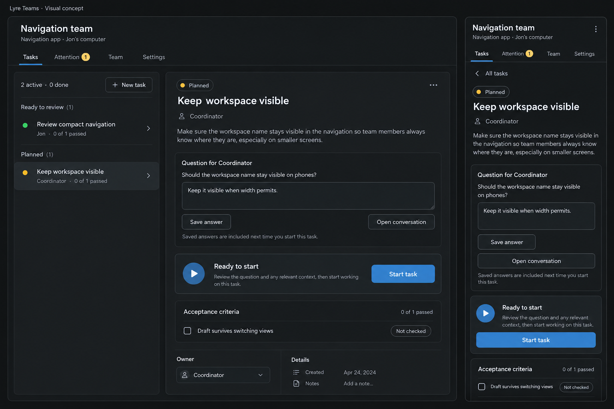
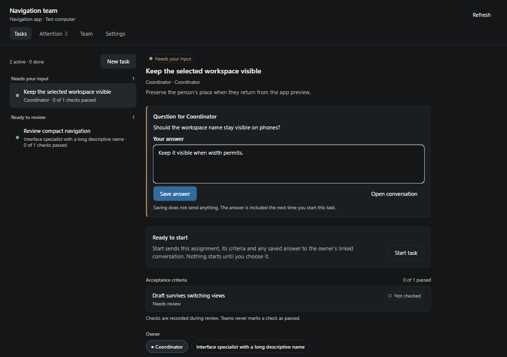
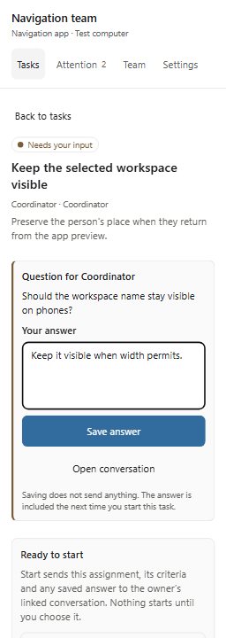

# Teams appearance

The owner requested a visual concept before this refinement. The generated image
below is a proposal with sample data, not an operational screenshot. The actual
implementation retains Lyre's palette, existing controls, task state and authority.

These browser captures render the real extension's React Native views and host
text input. Sheet, icon and toast plumbing is injected for browser qualification.
They do not establish installed desktop, native sheet or physical phone acceptance.

The initial client/design pass used Opus 5.5. After that session reached its limit,
the primary agent implemented and tested this concept-based refinement.
